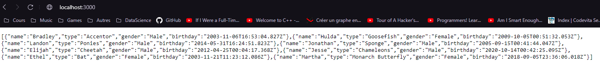
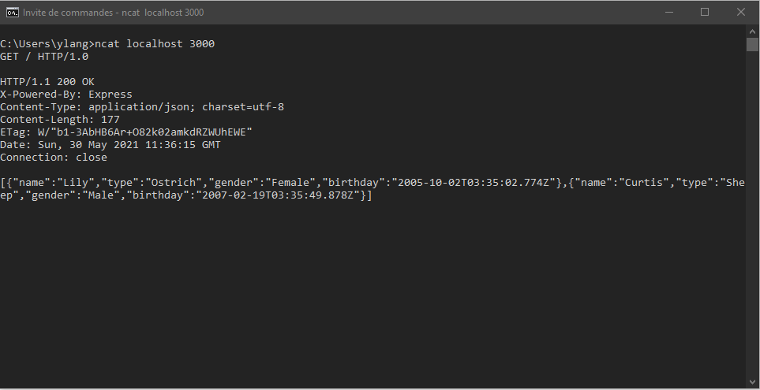
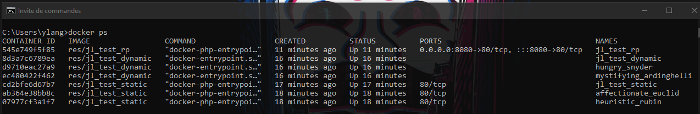
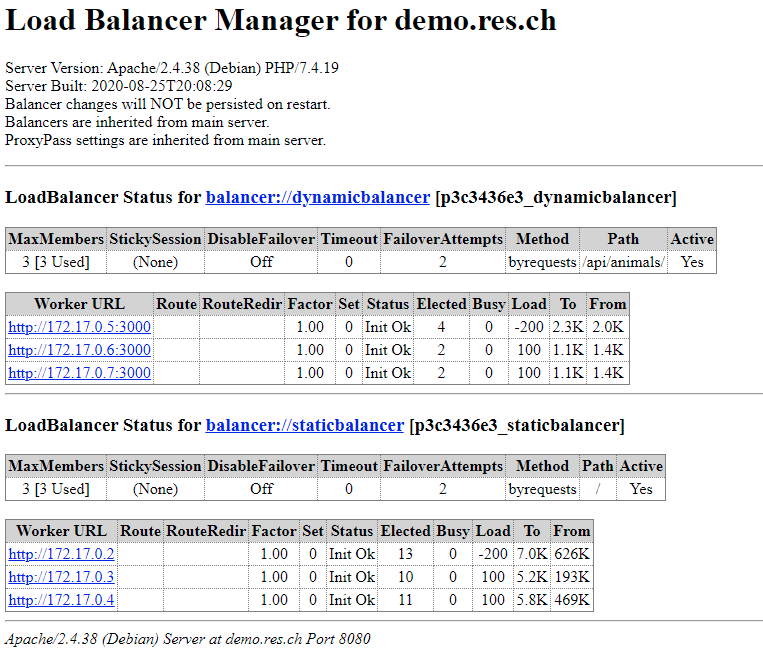
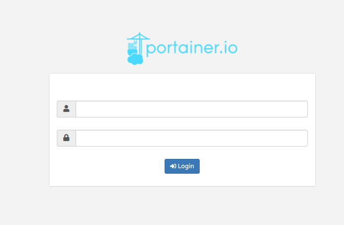
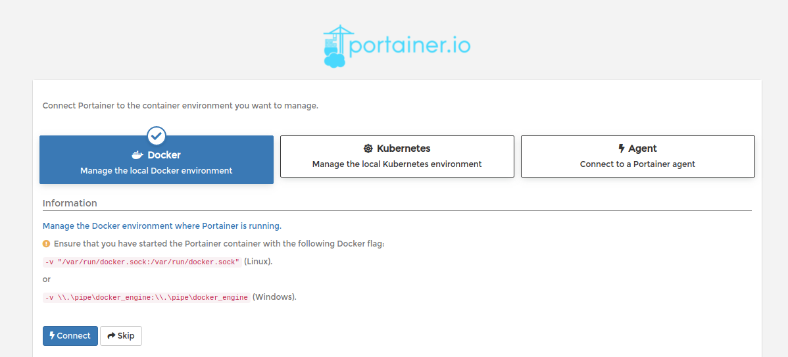
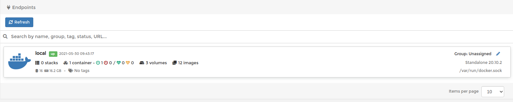
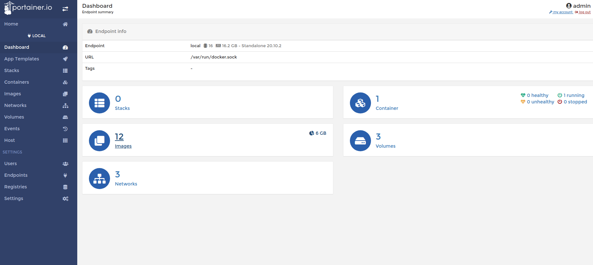
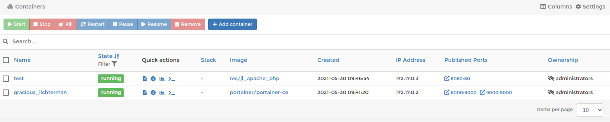
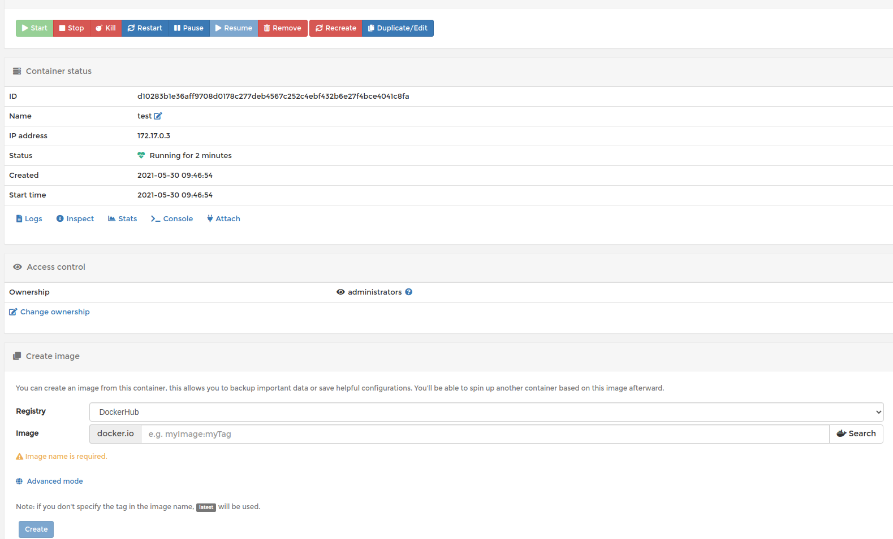

# RES-Labo-05-HTTP
Laboratoire HTTP Infrastructure du cours RES

## Step 1: Static HTTP server with apache httpd
#### branche : fb-apache-static

Dans cette étape nous devions configurer un serveur http statique.
Pour commencer nous avons crée un dossier `/apache-php-image`  dans un dossier `/docker-images` qui contiendra tout ce qui est nécessaire pour pouvoir créer une image docker d'un serveur `http statique`. 
Toujours dans notre dossier `/apache-php-image` nous avons crée notre fichier `Dockerfile` et un dossier `/content` qui contiendra un template web.

Pour le **Dockerfile** nous avons pris l'image officielle php [suivante](https://hub.docker.com/_/php). Notre **Dockerfile** ressemble à quelque chose comme ceci :

```
FROM php:7.4-apache

COPY content/ /var/www/html/
```

Pour le contenu web on a choisi le template html [suivant](https://startbootstrap.com/theme/agency) qu'on a mis à l'intérieur d'un dossier **/content**.

Ensuite il suffit d'ouvrir un terminal dans le dossier où se trouve notre **Dockerfile** et de construire l'image :
```
docker build -t res/apache_php .
```
Et de lancer on container en mappant un port au port http 80:
```
docker run -it -p 8080:80 res/apache_php
```
Maintenant si on ouvre un navigateur web et on écrit ``` localhost:8080``` on devrait avoir notre site html qui devrait s'afficher :


## Step 2: Dynamic HTTP server with express.js
#### branche : fb-express-dynamic

Dans cette étape nous devions configurer un serveur http dynamique.
Pour commencer nous avons crée un nouveau dossier ```/express-image``` de nouveau dans le dossier `/docker-images` qui contiendra tout ce qui est nécessaire pour notre image docker du serveur **http dynamique**.
Dans ce dossier nous avons crée comme avant un `Dockerfile` et avons pris l'image docker officielle [node.js](https://hub.docker.com/_/node) :

```
FROM node:14.17.0


COPY src /opt/app

CMD ["node", "/opt/app/index.js"]
```

Comme dans le `Dockerfile` on copie le contenu du dossier `/src` vers `/opt/app` il faudra avoir crée au préalable le dossier `/src` dans le même dossier que le `Dockerfile`. Il faut également avoir installé [node.js](https://nodejs.org/en/).
La dernière ligne de notre `Dockerfile` permettra de lancer le fichier `index.js` avec **node**.

Une fois ceci fait on peut lancer la commande (dans un terminal) ```npm init``` dans le dossier où l'on souhaite installer notre package (ici ça sera notre dossier `/src`). 
En plus d'avoir installé node.js il nous faudra quelques compléments comme :

 - le module [chance](https://chancejs.com/usage/node.html)
 - [express.js](https://expressjs.com/fr/)
 - [express generator](https://expressjs.com/fr/starter/generator.html)
 
Pour installer les modules il suffit de se mettre dans le dossier où l'on souhaite les installer (dossier **/src** dans notre cas) et on lance les commandes :
- `npm install chance --save `
- `npm install express --save`
- `npm install express-generator -g` (ici -g car on veut une installation générale car on va utiliser souvent ce module dans le future.

Maintenant créeons un fichier `index.js` dans notre dossier `/src` qui va nous retourner notre json d'animaux (un choix fait par nous, on aurait pu aussi retourner des étudiants, chats ou autre) :
```js
  
var Chance = require('chance');
var chance = new Chance();

//console.log("Bonjour " + chance.name())

var express = require('express');
var app = express();


app.get('/test', function(req, res){
	res.send("Hello RES - test");
});


app.get('/', function(req, res){
	res.send(generateAnimals());
});

app.listen(3000, function() {
	console.log('Accepting HTTP requests on port 3000.');
});

function generateAnimals() {
	var numberOfAnimals = chance.integer({
		min: 0,
		max: 10
	});
	console.log(numberOfAnimals);
	var animals = []
	for(var i = 0; i < numberOfAnimals; i++){
		
		var gender = chance.gender();
		var birthYear = chance.year({
			min: 2000,
			max: 2020
		});
		animals.push({
			name: chance.first({
				gender: gender
			}),
			type : chance.animal(),
			gender: gender,
			birthday: chance.birthday({
				year: birthYear
			})
		});
	};
	console.log(animals);
	return animals;
}
````

Pour tester qu'on reçoit bien notre json d'animaux il suffit de monter l'image docker, lancer un container ne mappant le port 3000:3000 et lancer l'URL suivante : `http://localhost:3000`
Le résultat devrait nous donner ceci :



Si on recharge à chaque fois la page on devrait avoir un résultat différent.

On pourrait aussi tester notre configuration en ouvrant un terminale et en lançant un netact : `ncat localhost 3000`
Puis en faisant une requête **HTTP** à la main : `GET / HTTP/1.0` Sans oublier 2 retours à la ligne après avoir entrée cette commande. Le résultat est un réponse HTTP avec le payload JSON.
Ensuite il suffit de lancer la requête HTTP suivante `GET / HTTP/1.0` faire 2 retours à la ligne et remarquer que nous avons reçu un json d'animaux :



## Step 3: Reverse proxy with apache (static configuration)
### branche : fb-apache-reverse-proxy
Dans cette partie nous devions implémenter un reverse proxy apache (en configuration static)

configuration de base 
pour configurer un simple reverse proxy il faut avoir les modules apache correctement installés
ces derniers sont activés via le `Dockerfile` 
```
RUN a2enmod proxy proxy_http proxy_balancer lbmethod_byrequests
RUN a2ensite 000-* 001-*
```

configurer notre site pour qu'il utilise le reverse proxy
```
<VirtualHost *:80>
	ServerName demo.res.ch
	
	ProxyPass "/api/students/" "http://172.17.0.3:3000/"
	ProxyPassReverse "/api/students/" "http://172.17.0.3:3000/"
	
	ProxyPass "/" "http://172.17.0.2:80/"
	ProxyPassReverse "/" "http://172.17.0.2:80/"	
</VirtualHost>

```


## construire les images docker depuis la racine 
```
Docker build -t res/jl_apache_php docker-images/apache-php-image/
Docker build -t res/jl_express_dynamic docker-images/express-image/
Docker build -t res/jl_apache_rp docker-images/apache-reverse-proxy/
```

## démarrer les conteneurs
__Attention__ on considère que il ya aucun autre conteneur de démarré. Pour que la configuration marche telle que représenté ci-dessus il faut démarrer dans cet ordre spécifique, sans aucun autre conteneur de démarré dans docker.Effectivement les addresses sont alloué à chaque démarrage par docker et incrémenté dans l'ordre de démarrage avec la machine docker commençant à x.x.x.1. Vu que  nous addresses sont codés en dur il est important de lancer les conteneurs dans le bon ordre pour que le conteneur static se termine par `172.17.0.2` et que le conteneur dynamic par `172.17.0.3`.
```
Docker run -d --name jl_static res/jl_apache_php
Docker run -d --name jl_dynamic res/jl_express_dynamic
Docker run -d -p 8080:80 --name jl_apache_rp res/jl_apache_rp

```

pour désormais accéder a notre site on peut acceder á l'url suivant demo.res.ch:8080

on peut effectivement voir aussi si on tente d'accéder aux serveurs statique et dynamique individuellement, ça ne marche pas.

## Mauvaise idée de configurer un site comme cela
configurer notre site comme cela est très hasardeux car supposon que l'on démarre d'autre conteneur dans docker les adresses IP seront différente, alors il faudrai a chaque fois changer les adresses dans le fichier config de notre site pour qu'il soient à jour.


## Step 4: AJAX requests with JQuery
### branche : fb-ajax-jquery

## construire les images docker depuis la racine 
```
Docker build -t res/jl_apache_php docker-images/apache-php-image/
Docker build -t res/jl_express_dynamic docker-images/express-image/
Docker build -t res/jl_apache_rp docker-images/apache-reverse-proxy/
```

## démarrer les conteneur
__Attention__ on considère que il ya aucun autre conteneur de démarré, pour que la configuration marche telle que représenté ci dessus il faut démarrer dans cet ordre spécifique, sans aucun autre conteneur de démarré dans docker (Même raison que pour la partie 3).
```
Docker run -d --name jl_static res/jl_apache_php
Docker run -d --name jl_dynamic res/jl_express_dynamic
Docker run -d -p 8080:80 --name jl_apache_rp res/jl_apache_rp

```
pour désormais accéder a notre site on peut acceder á l'url suivant demo.res.ch:8080

on va envoyer une requete a notre serveur dynamique toute les 2 secondes, ensuite on récupère le premier élément de notre objet json retourné. Et on l'affecte dans notre page HTML
dans notre cas les balises contenant la classe `.masthead-subheading` auront leurs contenu remplacé par des animeaux (:

```js
(function ($) {
	console.log("Loading animals");
	
	function loadAnimals() {
		$.getJSON("/api/animals/", function(animals) {
			console.log(animals);
			var message = "Nobody is here";
			
			if(animals.length > 0) {
				message = animals[0].name + " the " + animals[0].type;
			}
			$(".masthead-subheading").text(message);
		});
	};
	
	loadAnimals();
	setInterval(loadAnimals, 2000);
})(jQuery);
```

## Step 5: Dynamic reverse proxy configuration
### branche : fb-dynamic-configuration
## construire les images docker depuis la racine 
```
Docker build -t res/jl_apache_php docker-images/apache-php-image/
Docker build -t res/jl_express_dynamic docker-images/express-image/
Docker build -t res/jl_apache_rp docker-images/apache-reverse-proxy/
```

## demarer les conteneur
__Attention__ on considère que il ya aucun autre conteneur de démarré, pour que la configuration marche telle que représenté ci dessus il faut demarer dans cet ordre spécifique, sans aucun autre conteneur de démarré dans docker
```
Docker run -d --name jl_static res/jl_apache_php
Docker run -d --name jl_dynamic res/jl_express_dynamic
Docker run -d -e STATIC_APP=172.17.0.3 -e DYNAMIC_APP=172.17.0.2 -p 8080:80 --name jl_apache_rp res/jl_apache_rp

```
pour désormais accéder a notre site on peut acceder á l'url suivant demo.res.ch:8080

## configuration
pour cette étape on dois creer des variables d'environnement dans notre conteneur. `STATIC_APP` et `DYNAMIC_APP`, ces dernier sont créer avec les paramètre -e lors d'un `docker run`

en exécutant le fichier apache2-foreground on va exécuter le code php au démarage de notre conteneur, et écrire dans le fichier de configuration de notre site web, les adresses IP pour notre proxy seront alors injecté correctement.


## fichier template
```php
<?php
	$dynamic_app = getenv('DYNAMIC_APP');
	$static_app = getenv('STATIC_APP');
?>
<VirtualHost *:80>
	ServerName demo.res.ch
	
	ProxyPass '/api/animals/' 'http://<?php print "$dynamic_app"?>/'
	ProxyPassReverse '/api/animals/' 'http://<?php print "$dynamic_app"?>/'
	
	ProxyPass '/' 'http://<?php print "$static_app"?>/'
	ProxyPassReverse '/' 'http://<?php print "$static_app"?>/'	
</VirtualHost>
```


## Additional Setps : Load balancing multiple server nodes
### branche : fb-load-balancer
Pour cette étape bonus nous nous sommes basés sur la documentation officielle apache de leurs [load balancer](https://httpd.apache.org/docs/2.4/fr/mod/mod_proxy_balancer.html)
La documentation nous demande d'importer 3 modules nécessaire (`mod_proxy`, `mod_proxy_balancer` et un algorithme de planification de la répartition de tâche). Donc nous allons ajouter ces modules à notre `Dockerfile` de notre **reverse proxy** :

```
FROM php:7.4-apache

RUN apt-get update && \
	apt-get install -y vim
	
COPY apache2-foreground /usr/local/bin/
COPY templates /var/apache2/templates
COPY conf/ /etc/apache2

RUN a2enmod proxy proxy_http proxy_balancer lbmethod_byrequests
RUN a2ensite 000-* 001-*

RUN chmod +x /usr/local/bin/apache2-foreground
```

Nous allons également modifié notre fichier `config-template-php` comme ce que la documentation nous indique :

```php
<?php

	$dynamic_app = explode(',', getenv('DYNAMIC_APP'));
	$static_app = explode(',', getenv('STATIC_APP'));
	
	//$dynamic_app = getenv('DYNAMIC_APP');
	//$static_app = getenv('STATIC_APP');
?>
<VirtualHost *:80>
	ServerName demo.res.ch
	
	ErrorLog ${APACHE_LOG_DIR}/error.log
    CustomLog ${APACHE_LOG_DIR}/access.log combined
	
	<Proxy balancer://dynamicBalancer>
<?php
	foreach ($dynamic_app as &$dynamicIp){
		echo "	BalancerMember http://". $dynamicIp . "\n";
	}
?>
	</Proxy>
	
	<Proxy balancer://staticBalancer>
<?php
	foreach ($static_app as &$staticIp){
		echo "	BalancerMember http://". $staticIp . "\n";
	}
?>
	</Proxy>
	
   <Location /balancer-manager>
        SetHandler balancer-manager
        Order Deny,Allow
        Allow from all
    </Location>

    ProxyPass /balancer-manager !
	
	ProxyPass '/api/animals/' 'balancer://dynamicBalancer/'
	ProxyPassReverse '/api/animals/' 'balancer://dynamicBalancer/'
	
	ProxyPass '/' 'balancer://staticBalancer/'
	ProxyPassReverse '/' 'balancer://staticBalancer/'
	
</VirtualHost>
```
Pour tester le bon fonctionnement nous allons remonter l'image de notre reverse-proxy (et du site static et dynamic si ce n'est pas déja fait) et essayer avec 3 noeuds static et 3 noeuds dynamic.

## construire les images docker depuis la racine 
```
Docker build -t res/jl_apache_php docker-images/apache-php-image/
Docker build -t res/jl_express_dynamic docker-images/express-image/
Docker build -t res/jl_apache_rp docker-images/apache-reverse-proxy/
```

## démarrer les conteneur dynamic et static
```
docker run -d res/jl_apache_php
docker run -d res/jl_apache_php
docker run -d --name jl_test_static res/jl_apache_php
docker run -d res/jl_express_dynamic
docker run -d res/jl_express_dynamic
docker run -d --name jl_test_dynamic res/jl_express_dynamic
```
La raison pourquoi nous donnons un nom au dernier container de chaque type nous permet de vérifier à partir de quand les addresse static s'arrêtent et quand celles des dynamic commencent (Important pour la suite). 


## démarrer le conteneur reverse-proxy
Effectivement Docker donne les adresses des containers en incrément dans l'ordre de création (la machine docker qui commence à x.x.x.1 donc le 1er container commence à x.x.x.2) 
Dans notre cas de figure le container `jl_test_static` contient l'adresse `172.17.0.4` et le container `jl_test_dynamic` l'adresse `172.17.0.7` (Aucun autre container tourne au préalable). 
Donc pour lancer notre reverse proxy on va lancer les addresses de chaque container static et dynamic:
```docker run -d -e STATIC_APP=172.17.0.2:80,172.17.0.3:80,172.17.0.4:80 -e DYNAMIC_APP=172.17.0.5:3000,172.17.0.6:3000,172.17.0.7:3000 --name jl_test_rp -p 8080:80 res/jl_apache_rp```

Donc si on fait on docker ps on devrait avoir les 7 containers suivant qui tournent :



Maintenant si on lance notre site avec l'URL suivante : ```http://demo.res.ch:8080/balancer-manager/``` on a un interface web pour vérifier le bon fonctionnement de notre load balancer :


Nous remarquons que la colonne `MaxMembers` nous donne le nombre de container mais également le nombre utilisé. Ici on voit que tous nos containers sont utilisés car notre **Load Balancer** reparti les charges correctement entre les containers.

## Additional Steps : Dynamic cluster
### branche : fb-dynamic_cluster

On est partis sur une configuration avec serf


### Configuration


#### __fichier__ `clusterHandler.sh`


Ce fichier est lié aux évènements de l'agent serf qui tourne sur le reverse proxy,
il sera exécuté a chaque fois que un nouveau serveur arrive dans le cluster

les évènements utilsateurs à envoyer pour que ce script soit exécuté sont:
```
serf event static-join [addresse_ip]
serf event dynamic-join [addresse_ip]
```
le payload [addresse_ip] est lu par le fichier (`read ip`) et une nouvelle entrée sera crée
_exemple_
```
serf event static-join 172.17.0.4
#serf event recieved -> static_join
#execution du script
#insertion dans le fichier conf

#resultat :
<Proxy balancer://staticBalancer>
	BalancerMember http://172.17.0.4:80 <----ip rajouté (avant le #staticBalancer)
#staticBalancer
</Proxy>
``` 

il va mettre a jour le fichier configuration de notre site en ajoutant une entrée dans les balancer


```sh
static-join)
		read ip
		$(sed -i "/#staticBalancer/i\BalancerMember http:\/\/$ip:80" /etc/apache2/sites-enabled/001-reverse-proxy.conf)
		apachectl -k graceful
;;
dynamic-join)
		read ip
		$(sed -i "/#dynamicBalancer/i\BalancerMember http:\/\/$ip:3000" /etc/apache2/sites-enabled/001-reverse-proxy.conf)
		apachectl -k graceful
;; 
```


---

#### __fichier__ `failHandler.sh`
quand un noeud crash l'agent serf du reverse proxy vas executer ce fichier, il va supprimer de la liste des balancerMember l'entrée qui correspond à l'ip qui á échoué
pas besoin de précisier si c'etais un serveur statique ou dynamique
```sh
	read name ip
	$(sed -i "/$ip/d"  /etc/apache2/sites-enabled/001-reverse-proxy.conf)
	apachectl -k graceful
```
---
#### __fichier__ `config-template.php`
les contenu des Proxy sont vide au début car les addresses sont insérée au démarage d'un serveur et plus précisément après un evenment utilisateur `serf` de type `static-join` ou `dynamic-join`

---


### Scripts complémentaires
#### __fichier__ : `build_run.sh` 
```
./build_run.sh N M
```
Ce fichier va s'occuper de creer `N` conteneurs statique et `M` conteneurs dynamique, tout en démarant les services `serfs` dans chaque conteneur adapté

--- 
#### __fichier__ : `get_rp_config.sh` 
```
./get_rp_ip_config.sh
```

retourne le contenu du fichier configuration `001-reverse-proxy.conf`

--- 
#### __fichier__ : `getip.sh` 
```
./getip.sh
```
retourne les addresses ip de tout les conteneurs docker qui tournent sur la machine

--- 
#### __fichier__ : `gracefull_Stop.sh` 
```
./gracefull_stop.sh containername
```
arrête proprement le `containername`, fait un simple appel à docker stop `containername `

--- 
#### __fichier__ : `remove_container.sh` 
```
./remove_container.sh containername
```
supprime le `containername`, fait un simple appel à docker rm `containername`

--- 
#### __fichier__ : `start_container.sh` 
```
./start_container.sh containername static|dynamic
```
Démarre un conteneur précédement arrêté, et relance son agent serf

--- 
#### __fichier__ : `start_new_container.sh` 
```
./start_new_container.sh containername static|dynamic
```
Démarre un nouveau conteneur, et lance son agent serf

--- 
#### __fichier__ : `stop_all_container.sh` 
```
./stop_all_container.sh nbstatic nbdynamic
```
Arrête les conteneurs crées avec le fichier `build_run.sh` de façon abrupte

--- 

### validation 

* `./build_run.sh 2 2`
* attendre la fin de l'exécution
* ouvrir un navigateur à : demo.res.ch:8080/balancer-manager
* vérifier si les balancerMember sont présent
* `docker kill static1`
* rafraichir : demo.res.ch:8080/balancer-manager
* l'entrée correspondant a static1 est plus présent
* `./start_new_containre.sh new_node static`
* une nouvelle addresse ip dans les entrée de staticBalancer
* tester le fonctionnement du site : demo.res.ch:8080

--- 

## Additional Steps : Management UI
Nous avons décidé de utilser l'interface web [portainer](https://www.portainer.io/)

### installation

```
docker run -d -p 9000:9000 -p 8000:8000 --name portainer -v /var/run/docker.sock:/var/run/docker.sock portainer/portainer-ce --admin-password='$2y$05$qFHAlNAH0A.6oCDe1/4W.ueCWC/iTfBMXIHBI97QYfMWlMCJ7N.a6'

```

cette commande va installer la version community édition de portainer, elle sera démaré avec le service docker à chaque démarrage

### utilisation


* username : admin
* password : password
---
selectionner docker ensuite connectez vous


---
selectionnez local


--- 



* containers : afficher tout les conteneurs disponibles

* images : affiche toute les images disponibles
---

gérer un conteneur

on utilise un conteneur test statique 
```
docker run -d -p 8080:80 --name test res/jl_apache_php
```

cliquez sur test

maintenant on peut gérer notre conteneur graphiquement,
les contrôles de bases
*	logs : affiche les logs du conteneur
* 	inspect : instpecter le conteneur
* 	console : se connecter en interactif 

on peut l'arrêter,démarrer , etc,etc
